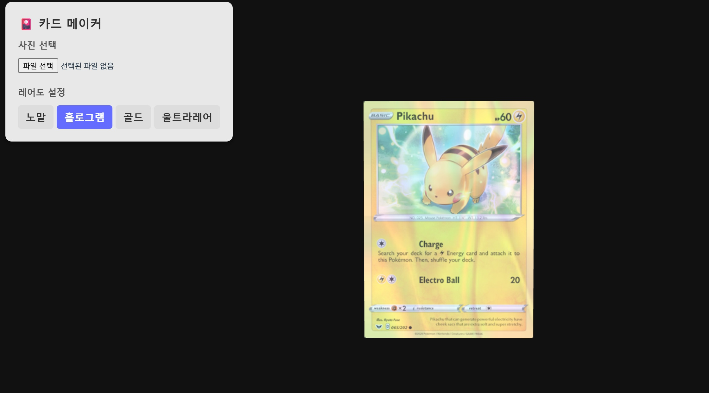

# 🎴 3D Card Maker

**React Three Fiber**와 **Custom Shader(GLSL)**를 활용한 인터랙티브 3D 포토카드 메이커입니다.
사용자가 원하는 이미지를 업로드하고, 다양한 홀로그램 레어도를 실시간으로 적용할 수 있습니다.



## ✨ Key Features (주요 기능)

- **🖼️ Custom Image Upload**: 로컬 이미지를 업로드하여 카드에 즉시 적용
- **✨ Rarity System**: 버튼 클릭으로 레어도 변경 (Normal / Hologram / Gold / Ultra Rare)
- **🖱️ Interactive 3D Tilt**: 마우스 호버 시 시선을 따라 움직이는 3D 틸트 효과
- **🎨 Custom GLSL Shaders**:
  - `mix()` 함수를 활용한 텍스처 블렌딩
  - 마우스 좌표에 반응하는 동적 홀로그램 효과
  - 레어도별(Gold, Ultra Rare) 고유 쉐이더 로직 구현

## 🛠️ Tech Stack (기술 스택)

- **Core**: React, Vite
- **3D & Graphics**: Three.js, React Three Fiber (R3F), @react-three/drei
- **Language**: JavaScript (ES6+), GLSL (Fragment Shader)
- **State Management**: React Hooks (useState, useRef)

## 🚀 How to Run (실행 방법)

```bash
# 1. Repository Clone
git clone [https://github.com/umgeunchan/card-maker.git](https://github.com/umgeunchan/card-maker.git)

# 2. Install Dependencies
npm install

# 3. Run Dev Server
npm run dev
```
